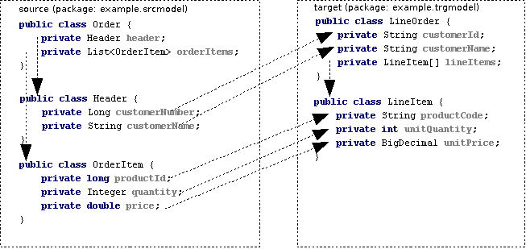

= Smooks JavaBean Cartridge

image:https://img.shields.io/maven-central/v/org.smooks.cartridges/smooks-javabean-cartridge[Maven Central]
image:https://img.shields.io/nexus/s/org.smooks.cartridges/smooks-javabean-cartridge?server=https%3A%2F%2Foss.sonatype.org[Sonatype Nexus (Snapshots)]
image:https://github.com/smooks/smooks-javabean-cartridge/workflows/CI/badge.svg[Build Status]

// tag::smooks-javabean-cartridge[]
Smooks can map a Java object graph to another Java object graph. This mapping is accomplished through events, which means no intermediate object is constructed for populating the target Java object graph. In other words, the source Java object graph is turned into a stream of events that are bound to the target Java object graph.

Consider an _Order_ object needing to be mapped to a _LineOrder_ object. Conceptually,  the mapping from the source to target object model would be:

One can easily view the event stream produced from the source object (i.e., _Order_) if Smooks's _HTML Report Generator_ is running:

[source,xml]
----
<example.srcmodel.Order>  
    <header>  
        <customerNumber>...</customerNumber>
        <customerName>...</customerName>  
    </header>  
    <orderItems>  
        <example.srcmodel.OrderItem>  
            <productId>...</productId>  
            <quantity>...</quantity>  
            <price>...</price>  
        </example.srcmodel.OrderItem>  
    </orderItems>  
</example.srcmodel.Order>
----

Mapping the source object is a matter of targeting the Smooks Javabean resources at the above event stream. Such a Smooks config performing the mapping would look like:

.smooks-config.xml
[source,xml]
----
<?xml version="1.0"?>  
<smooks-resource-list xmlns="https://www.smooks.org/xsd/smooks-2.0.xsd"
                      xmlns:jb="https://www.smooks.org/xsd/smooks/javabean-1.6.xsd">  

    <jb:bean beanId="lineOrder" class="example.trgmodel.LineOrder" createOnElement="example.srcmodel.Order">  
        <jb:wiring property="lineItems" beanIdRef="lineItems" />  
        <jb:value property="customerId" data="header/customerNumber" />  
        <jb:value property="customerName" data="header/customerName" />  
    </jb:bean>  

    <jb:bean beanId="lineItems" class="example.trgmodel.LineItem[]" createOnElement="orderItems">  
        <jb:wiring beanIdRef="lineItem" />  
    </jb:bean>  

    <jb:bean beanId="lineItem" class="example.trgmodel.LineItem" createOnElement="example.srcmodel.OrderItem">  
        <jb:value property="productCode" data="example.srcmodel.OrderItem/productId" />  
        <jb:value property="unitQuantity" data="example.srcmodel.OrderItem/quantity" />  
        <jb:value property="unitPrice" data="example.srcmodel.OrderItem/price" />  
    </jb:bean>  

</smooks-resource-list>
----

== Java to Java

The source object is provided to Smooks via a `+org.smooks.io.payload.JavaSource+` instance. This object is created by passing the constructor the root object of the source model. The resulting `+JavaSource+` object is used in the `+Smooks#filter+` method. The resulting code could look like as follows:

[source,java]
----
protected LineOrder runSmooksTransform(Order srcOrder) throws Exception {  
    Smooks smooks = new Smooks("smooks-config.xml");  
    ExecutionContext executionContext = smooks.createExecutionContext();  

    // Transform the source Order to the target LineOrder via a  
    // JavaSource and JavaResult instance...  
    JavaSource source = new JavaSource(srcOrder);  
    JavaResult result = new JavaResult();  

    // Configure the execution context to generate a report...  
    executionContext.setEventListener(new HtmlReportGenerator("target/report/report.html"));  

    smooks.filterSource(executionContext, source, result);  

    return (LineOrder) result.getBean("lineOrder");  
}
----

== Java to Text (XML, CSV, EDI, etc...)

The Smooks core runtime works by processing a stream of SAX events produced by an input source of some type (XML, EDI, Java, etc...) and using those events to fire visitors. In the case of a Java source (see previous section on "Java to Java"), Smooks uses XStream to generate this stream of SAX events.

Sometimes, however, you just want to apply a template (e.g. a FreeMarker template) to a Java Source object model and produce XML, CSV, EDI, etc... You don't want to incur the wasted overhead of generating a stream of SAX events that you are not going to use. To do this, you need to tell the Smooks core runtime to not generate the stream of events. This can be done in one of two ways.

By calling `+setEventStreamRequired(false)+` on the `+JavaSource+` instance being supplied to `+Smooks.filterSource+`:

[source,java]
----
JavaSource javaSource = new JavaSource(orderBean);  

// Turn streaming off via the JavaSource...  
javaSource.setEventStreamRequired(false);  

smooks.filterSource(javaSource, result);
----

Or, by turning off the "http://www.smooks.org/sax/features/generate-java-event-stream" `+<reader>+` feature in the Smooks configuration:

[source,xml]
----
<?xml version="1.0"?>  
<smooks-resource-list xmlns="https://www.smooks.org/xsd/smooks-2.0.xsd">  

    <reader>  
        <features>  
            <setOff feature="http://www.smooks.org/sax/features/generate-java-event-stream" />  
        </features>  
    </reader>  

    <!-- Other Smooks configurations e.g. a FreeMarker template... -->  

</smooks-resource-list>
----

When applying the FreeMarker template, the name of the templating context beans (i.e. the names used in your template) depends on the Object type in the JavaSource:

. If the object is a `+Map+`, then that Map instance becomes the templating context and so you can just use the Map entry keys as the bean names in your template.
. For non-map objects, the `+JavaSource+` class takes the Object Class SimpleName and creates a JavaBean property name from it. This is the name of the context bean used for the templating. So, if the bean class name is `+com.acme.Order+`, then the context bean name, for the purpose of templating, will be "order".

== Java Binding

The JavaBean Cartridge allows you to create and populate Java POJOs from your message data (i.e., bind data).

=== Java Binding Overview

This feature of Smooks can be used in its own right purely as a Java binding framework for XML, EDI, CSV, etc... However, it is very important to remember that the Java Binding capabilities in Smooks are the cornerstone of many other capabilities provided by Smooks. This is because Smooks makes the Java objects it creates (and binds data into) available through the link:/javadoc/v1.7.1/smooks/org/milyn/javabean/context/BeanContext.html[BeanContext] class. This is essentially a Java Bean context that is made available to any Smooks visitor via the Smooks link:/javadoc/v1.7.1/smooks/org/milyn/container/ExecutionContext.html[ExecutionContext].

Some of the existing features that build on the functionality provided in the Javabean Cartridge include:

* link:#templating[Templating]: Templating typically involves applying a template (FreeMarker or other) to the objects in the BeanContext.
* link:#rule-based-validation[Validation]: Business Rules Validation (e.g. via MVEL) typically involves applying a rule (expression, etc...) to the objects in the BeanContext.
* link:#message-splitting--routing[Message Splitting & Routing]: Message Splitting typically works by generating split messages from the Objects in the BeanContext, either by using the objects themselves and routing them, or by applying a template to them and routing the result of that templating operation (e.g. a new XML, CSV, etc...).
* link:#routing-to-a-database-using-sql[Persistence (Database Reading and Writing)]: The Persistence features depend on the Java Binding functions for creating and populating the Java objects (Entities etc) to be persisted. Data read from a database is typically bound into the BeanContext.
* link:#enriching-output-data[Message Enrichment]: As stated above, enrichment data (e.g. read from a DB) is typically bound into the BeanContext, from where it is available to all other features, including the Java Binding functionality itself e.g. for expression-based bindings. This allows messages generated by Smooks to be enriched.

=== When to use Smooks Java Binding

A question that often comes to mind is "_Why would I use Smooks to perform binding to a Java objects model instead of JAXB or http://jibx.sourceforge.net/[JiBX]?_". Well there are a number of reasons why you would use Smooks and there are a number of reasons why you would not use Smooks.

When Smooks makes sense:

. Binding non-XML data to a Java object model e.g. EDI, CSV, JSON, etc...
. Binding data (XML or other) whose data model (hierarchical structure) does not match that of the target Java object model. http://jibx.sourceforge.net/[JiBX] also supports this, but only for XML (AFAIK!!).
. When you are binding data from an XML data structure for which there is no defined schema (XSD). Some frameworks effectively require a well defined XML data model via schema.
. When binding data from multiple existing and different data formats into a single pre-existing Java object model. Related to the above points.
. When binding data into existing 3rd Party Object Models that you cannot modify e.g. through a post-compile step.
. In situations where the Data (XML or other) and Java object models may vary in isolation from each other. Because of #2 above, Smooks can handle this by simply modifying the binding configuration. Other frameworks often require binding/schema regeneration, redeployment, etc... (see #3 above).
. Where you need to execute additional logic in parallel to the binding process e.g. Validation, Split Message Generation (via Templates), Split Message Routing, Fragment Persistence, or any custom logic that you may wish to implement. This is often a very powerful capability e.g. when processing huge message streams.
. Processing huge message streams by splitting them into a series of many small object models and routing them to other systems for processing.
. When using other Smooks features that rely on the Smooks Java Binding capabilities.

When Smooks may not make sense:

. When you have a well defined data model (via schema/XSD) and all you need to do is bind data into an object model (no required validation, persistence, etc...).
. When the object model is isolated from other systems and so can change without impacting such systems.
. Where processing XML and performance is paramount over all other considerations (where nanoseconds matter), frameworks such as http://jibx.sourceforge.net/[JiBX] are definitely worth considering over Smooks. This is not to imply that the performance of Smooks Java Binding is poor in any way, but it does acknowledge the fact that frameworks that utilise post-compile optimizations targeted at a specific data format (e.g. XML) will always have the edge under the right conditions.

=== Basics of Java Binding

As you know, Smooks supports a range of source data formats (XML, EDI, CSV, Java, etc...), but for the purposes of this topic, we will always refer to the message data in terms of an XML format. In the examples, we will continuously refer to the following XML message:

[source,xml]
----
<order>  
    <header>  
        <date>Wed Nov 15 13:45:28 EST 2006</date>  
        <customer number="123123">Joe</customer>  
    </header>  
    <order-items>  
        <order-item>  
            <product>111</product>  
            <quantity>2</quantity>  
            <price>8.90</price>  
        </order-item>  
        <order-item>  
            <product>222</product>  
            <quantity>7</quantity>  
            <price>5.20</price>  
        </order-item>  
    </order-items>  
</order>
----

In some examples we will use different XML message data. Where this happens, the data is explicitly defined there then.

The JavaBean Cartridge is used via the https://www.smooks.org/xsd/smooks/javabean-1.6.xsd configuration namespace. Install the schema in your IDE and avail of autocompletion.

An example configuration:

[source,xml]
----
<smooks-resource-list xmlns="https://www.smooks.org/xsd/smooks-2.0.xsd"
                      xmlns:jb="https://www.smooks.org/xsd/smooks/javabean-1.6.xsd">  

    <jb:bean beanId="order" class="example.model.Order" createOnElement="#document" />  

</smooks-resource-list>
----

This configuration simply creates an instance of the `+example.model.Order+` class and binds it into the *bean context* under the beanId `+order+`. The instance is created at the very start of the message on the #document element (i.e. the start of the root element).

* `+beanId+`: The id of this bean. Please see link:#the-bean-context[The Bean Context] for more details.
* `+class+`: The fully qualified class name of the bean.
* `+createOnElement+`: attribute controls when the bean instance is created. Population of the bean properties is controlled through the binding configurations (child elements of the element).
* `+createOnElementNS+`: The namespace of the createOnElement can be specified via the `+createOnElementNS+` attribute.

The Javabean cartridge has the following conditions for javabeans:

. A public no-argument constructor
. Public property setter methods. The don't need to follow any specific name formats, but it would be better if they do follow the standard property setter method names.
. Setting javabean properties directly is not supported.

=== Java Binding Configuration Details

The configuration shown above simply created the _example.model.Order_ bean instance and bound it into the bean context. This section will describe how to bind data into that bean instance.

The Javabean Cartridge provides support for 3 types of data bindings, which are added as child elements of the `+<jb:bean>+` element:

* `+<jb:value>+`: This is used to bind data values from the Source message event stream into the target bean.
* `+<jb:wiring>+`: This is used to "wire" another bean instance from the bean context into a bean property on the target bean. This is the configuration that allows you to construct an object graph (Vs just a loose bag of Java object instances). Beans can be wired in based on their "beanId", their Java class type, or by Annotation (by being annotated with a specific Annotation).
* `+<jb:expression>+`: As it's name suggests, this configuration is used to bind in a value calculated from an expression (in the http://mvel.documentnode.com/[MVEL] language), a simple example being the binding of an order item total value into an OrderItem bean based on the result of an expression that calculates the value from the items price and quantity (e.g. "price * quantity"). The `+execOnElement+` attribute expression defines the element on which the expression is to be evaluated and the result bound. If not defined, the expression is executed based on the value of the parent . The value of the targeted element is available in the expression as a String variable under the name `+_VALUE+` (notice the underscore).

Taking the Order XML message (previous section), lets see what the full XML to Java binding configuration might be. We've seen the order XML (above). Now lets look at the Java objects that we want to populate from that XML message (getters and setters not shown):

[source,java]
----
public class Order {
    private Header header;
    private List<OrderItem> orderItems;
}

public class Header {
    private Date date;
    private Long customerNumber;
    private String customerName;
    private double total;
}

public class OrderItem {
    private long productId;
    private Integer quantity;
    private double price;
}
----

The Smooks config required to bind the data from the order XML and into this object model is as follows:

[source,xml]
----
<?xml version="1.0"?>  
<smooks-resource-list xmlns="https://www.smooks.org/xsd/smooks-2.0.xsd" xmlns:jb="https://www.smooks.org/xsd/smooks/javabean-1.6.xsd">  

(1)   <jb:bean beanId="order" class="com.acme.Order" createOnElement="order">  
(1.a)     <jb:wiring property="header" beanIdRef="header" />  
(1.b)     <jb:wiring property="orderItems" beanIdRef="orderItems" />  
      </jb:bean>  

(2)   <jb:bean beanId="header" class="com.acme.Header" createOnElement="order">  
(2.a)     <jb:value property="date" decoder="Date" data="header/date">  
              <jb:decodeParam name="format">EEE MMM dd HH:mm:ss z yyyy</jb:decodeParam>  
          </jb:value>  
(2.b)     <jb:value property="customerNumber" data="header/customer/@number" />  
(2.c)     <jb:value property="customerName" data="header/customer" />  
(2.d)     <jb:expression property="total" execOnElement="order-item" >  
              += (orderItem.price * orderItem.quantity);  
          </jb:expression>  
      </jb:bean>  

(3)   <jb:bean beanId="orderItems" class="java.util.ArrayList" createOnElement="order">  
(3.a)     <jb:wiring beanType="com.acme.OrderItem" /> <!-- Could also wire using beanIdRef="orderItem" -->  
      </jb:bean>  

(4)   <jb:bean beanId="orderItem" class="com.acme.OrderItem" createOnElement="order-item">  
(4.a)     <jb:value property="productId" data="order-item/product" />  
(4.b)     <jb:value property="quantity" data="order-item/quantity" />  
(4.c)     <jb:value property="price" data="order-item/price" />  
      </jb:bean>  

</smooks-resource-list>
----

++++
<table border="1" cellspacing="0" cellpadding="3" style="border: 1px solid; background-color: rgb(238, 238, 238)" width="100%">
   <tbody>
      <tr>
         <td width="15%" align="center"> <i>(1)</i>
         </td>
         <td width="85%">
            Configuration <b>(1)</b> defines the creation rules for the <i>com.acme.Order</i> bean instance (top level bean). We create this bean instance at the very start of the message i.e. on the &lt;order&gt; element . In fact, we create each of the beans instances (<b>(1)</b>, <b>(2)</b>, <b>(3)</b> - all accepts <b>(4)</b>) at the very start of the message (on the &lt;order&gt; element). We do this because there will only ever be a single instance of these beans in the populated model.
            
Configurations <b>(1.a)</b> and <b>(1.b)</b> define the <b>wiring</b> configuration for wiring the <i>Header</i> and <i>List&lt;OrderItem&gt;</i> bean instances (<b>(2)</b> and <b>(3)</b>) into the Order bean instance (see the <b>beanIdRef</b> attribute values and how the reference the <b>beanId</b> values defined on <b>(2)</b> and <b>(3)</b>). The <b>property</b> attributes on <b>(1.a)</b> and <b>(1.b)</b> define the <i>Order</i> bean properties on which the wirings are to be made.  Note also that beans can also be wired into an object based on their Java class type (<b>beanType</b>), or by being annotated with a specific Annotation (<b>beanAnnotation</b>).
            

         </td>
      </tr>
      <tr>
         <td width="15%" align="center"> <i>(2)</i>
         </td>
         <td width="85%">
            Configuration <b>(2)</b> creates the <i>com.acme.Header</i> bean instance.
            
Configuration <b>(2.a)</b> defines a <b>value</b> binding onto the <i>Header.date</i> property. Note that the <b>data</b> attribute defines where the binding value is selected from the source message; in this case it is coming from the header/date element. Also note how it defines a <b>decodeParam</b> sub-element. This configures the DateDecoder.
            

            
Configuration <b>(2.b)</b> defines a <b>value</b> binding configuration onto <i>Header.customerNumber</i> property. What should be noted here is how to configure the <b>data</b> attribute to select a binding value from an element attribute on the source message. Configuration <b>(2.b)</b> also defines an <b>expression</b> binding where the order total is calculated and set on the <i>Header.total</i> property. The <b>execOnElement</b> attribute tells Smooks that this expression needs to be evaluated (and bound/rebound) on the order-item element. So, if there are multiple &lt;order-item&gt; elements in the source message, this expression will be executed for each &lt;order-item&gt; and the new total value rebound into the <i>Header.total</i> property. Note how the expression adds the current orderItem total to the current order total (header.total).
            

            
Configuration <b>(2.d)</b> defines an expression binding, where a running total is calculated by adding the total for each order item (quantity * price) to the current total.
            

         </td>
      </tr>
      <tr>
         <td width="15%" align="center"> <i>(3)</i>
         </td>
         <td width="85%">
            Configuration <b>(3)</b> creates the <i>List&lt;OrderItem&gt;</i> bean instance for holding the <i>OrderItem</i> instances.
            
Configuration <b>(3.a)</b> wires all beans of type com.acme.OrderItem ( i.e. <b>(4)</b>) into the list. Note how this wiring does not define a <b>property</b> attribute. This is because it wires into a Collection (same applies if wiring into an array).  Also note that we could have performed this wiring using the <b>beanIdRef</b> attribute instead of the <b>beanType</b> attribute.
            

         </td>
      </tr>
      <tr>
         <td width="15%" align="center"> <i>(4)</i>
         </td>
         <td width="85%">
            Configuration <b>(4)</b> creates the <i>OrderItem</i> bean instances. Note how the <b>createOnElement</b> is set to the &lt;order-item&gt; element. This is because we want a new instance of this bean to be created for every &lt;order-item&gt; element (and wired into the <i>List&lt;OrderItem&gt;</i> <b>(3.a)</b>).
            
If the <b>createOnElement</b> attribute for this configuration was not set to the &lt;order-item&gt; element (e.g. if it was set to one of the &lt;order&gt;, &lt;header&gt; or &lt;order-items&gt; elements), then only a single <i>OrderItem</i> bean instance would be created and the binding configurations (<b>(4.a)</b> etc) would overwrite the bean instance property bindings for every &lt;order-item&gt; element in the source message i.e. you would be left with a <i>List&lt;OrderItem&gt;</i> with just a single <i>OrderItem</i> instance containing the &lt;order-item&gt; data from the last &lt;order-item&gt; encountered in the source message.
            

         </td>
      </tr>
   </tbody>
</table>
 
++++

*Binding Tips*

* `+<jb:bean createOnElement>+`
. Set it to the root element (or `+#document+`): For bean instances where only a single instance will exist in the model.
. Set it to the recurring element: For Collection bean instances. If you don't specify the correct element in this case, you could loose data.
* `+<jb:value decoder>+`
. In most cases, Smooks will automatically detect the datatype decoder to be used for a `+<jb:value>+` binding. However, some decoders require configuration e.g. the DateDecoder (`+decoder="Date"+`). In these cases, the decoder attribute should be defined on the binding, as well as the <jb:decodeParam> child elements for specifying the decode parameters for that decoder. link:/javadoc/v1.7.1/smooks/org/milyn/javabean/decoders/package-summary.html[See the full list of DataDecoder available out-of-the-box].
* `+<jb:wiring property>+`
. Not required when binding into Collections.
* Collections
. Just define the to be the required Collection type and wire in the Collection entries.
. For arrays, just postfix the attribute value with square brackets e.g. `+class="com.acme.OrderItem[]"+`.

==== Type Converters

In most cases, Smooks will automatically detect the datatype type converter to be used for a given `+<jb:value>+` binding. However, some decoders require configuration e.g. the TypeConverter (decoder="Date").In these cases, the converter attribute should be defined on the binding, as well as the `+<jb:decodeParam>+` child elements for specifying the decode parameters for that converter.

===== Type Conversion

A number of date-based type converter implementations are available:

* *link:/javadoc/v1.7.1/smooks/org/milyn/javabean/decoders/DateDecoder.html[Date]*: Decode/Encode a String to a _java.util.Date_ instance.
* *link:/javadoc/v1.7.1/smooks/org/milyn/javabean/decoders/CalendarDecoder.html[Calendar]*: Decode/Encode a String to a _java.util.Calendar_ instance.
* *link:/javadoc/v1.7.1/smooks/org/milyn/javabean/decoders/SqlDateDecoder.html[SqlDate]*: Decode/Encode a String to a _java.sql.Date_ instance.
* *link:/javadoc/v1.7.1/smooks/org/milyn/javabean/decoders/SqlTimeDecoder.html[SqlTime]*: Decode/Encode a String to a _java.sql.Time_ instance.
* *link:/javadoc/v1.7.1/smooks/org/milyn/javabean/decoders/SqlTimestampDecoder.html[SqlTimestamp]*: Decode/Encode a String to a _java.sql.Timestamp_ instance.

All of these date-based type converter implementations are configured in the same way.

*Date* Example:

[source,xml]
----
<jb:value property="date" decoder="Date" data="order/@date">  
    <jb:decodeParam name="format">EEE MMM dd HH:mm:ss z yyyy</jb:decodeParam>  
    <jb:decodeParam name="locale">sv_SE</jb:decodeParam>  
</jb:value>
----

*SqlTimestamp* Example:

[source,xml]
----
<jb:value property="date" decoder="SqlTimestamp" data="order/@date">  
    <jb:decodeParam name="format">EEE MMM dd HH:mm:ss z yyyy</jb:decodeParam>  
    <jb:decodeParam name="locale">sv</jb:decodeParam>  
</jb:value>
----

The _format_ decodeParam is based on the http://www.w3.org/TR/NOTE-datetime[ISO 8601] standard for Date formatting. See http://java.sun.com/j2se/1.5.0/docs/api/java/text/SimpleDateFormat.html[SimpleDateFormat] Javadoc and http://en.wikipedia.org/wiki/ISO_8601[Wikipedia] for more information.

The _locale_ decodeParam value is an underscore separated string, with the first token being the http://www.loc.gov/standards/iso639-2/php/English_list.php[ISO Language Code] for the Locale and the second token being the http://www.iso.ch/iso/en/prods-services/iso3166ma/02iso-3166-code-lists/list-en1.html[ISO Country Code]. This decodeParam can also be specified as 2 separate parameters for language and country e.g.:

[source,xml]
----
<jb:value property="date" decoder="Date" data="order/@date">  
    <jb:decodeParam name="format">EEE MMM dd HH:mm:ss z yyyy</jb:decodeParam>  
    <jb:decodeParam name="locale-language">sv</jb:decodeParam>  
    <jb:decodeParam name="locale-country">SE</jb:decodeParam>  
</jb:value>
----

===== Number Decoding

A number of Number based type converter implementations are available:

* *link:/javadoc/v1.7.1/smooks/org/milyn/javabean/decoders/BigDecimalDecoder.html[BigDecimalDecoder]*: Decode/Encode a String to a _java.math. BigDecimal_ instance.
* *link:/javadoc/v1.7.1/smooks/org/milyn/javabean/decoders/BigIntegerDecoder.html[BigIntegerDecoder]*: Decode/Encode a String to a _java.math. BigInteger_ instance.
* *link:/javadoc/v1.7.1/smooks/org/milyn/javabean/decoders/DoubleDecoder.html[DoubleDecoder]*: Decode/Encode a String to a _java.lang.Double_ instance (including primitive).
* *link:/javadoc/v1.7.1/smooks/org/milyn/javabean/decoders/FloatDecoder.html[FloatDecoder]*: Decode/Encode a String to a _java.lang.Float_ instance (including primitive).
* *link:/javadoc/v1.7.1/smooks/org/milyn/javabean/decoders/IntegerDecoder.html[IntegerDecoder]*: Decode/Encode a String to a _java.lang.Integer_ instance (including primitive).
* *link:/javadoc/v1.7.1/smooks/org/milyn/javabean/decoders/LongDecoder.html[LongDecoder]*: Decode/Encode a String to a _java.lang.Long' instance (including primitive)._
* *link:/javadoc/v1.7.1/smooks/org/milyn/javabean/decoders/ShortDecoder.html[ShortDecoder]*: Decode/Encode a String to a _java.lang.Short_ instance (including primitive).

All of these Number based type converter implementations are configured in the same way.

*BigDecimal* Example:

[source,xml]
----
<jb:value property="price" decoder="BigDecimal" data="orderItem/price">  
    <jb:decodeParam name="format">#,###.##</jb:decodeParam>  
    <jb:decodeParam name="locale">en_IE</jb:decodeParam>  
</jb:value>
----

*Integer* Example:

[source,xml]
----
<jb:value property="percentage" decoder="Integer" data="vote/percentage">  
    <jb:decodeParam name="format">#%</jb:decodeParam>  
</jb:value>
----

The _format_ decodeParam is based on the http://java.sun.com/docs/books/tutorial/i18n/format/decimalFormat.html[NumberFormat] pattern syntax.

The _locale_ decodeParam value is an underscore separated string, with the first token being the
http://www.loc.gov/standards/iso639-2/php/English_list.php[ISO Language Code] for the Locale and the second token being the http://www.iso.ch/iso/en/prods-services/iso3166ma/02iso-3166-code-lists/list-en1.html[ISO Country Code]. This decodeParam can also be specified as 2 separate parameters for language and country e.g.,:

[source,xml]
----
<jb:value property="price" decoder="Double" data="orderItem/price">  
    <jb:decodeParam name="format">#,###.##</jb:decodeParam>  
    <jb:decodeParam name="locale-language">sv</jb:decodeParam>  
    <jb:decodeParam name="locale-country">SE</jb:decodeParam>  
</jb:value>
----

===== Mapping Decoding

Sometimes you want to bind a different value into your object model, based on the data in your input message. You could use an expression based binding to do this, but you could also use a Mapping type converter as follows:

[source,xml]
----
<jb:value property="name" decoder="Mapping" data="history/@warehouse">  
    <jb:decodeParam name="1">Dublin</jb:decodeParam>  
    <jb:decodeParam name="2">Belfast</jb:decodeParam>  
    <jb:decodeParam name="3">Cork</jb:decodeParam>  
</jb:value>
----

In the above example, an input data value of "1" is mapped onto the "name" property as a value of "Dublin". Likewise for values "2" and "3".

===== Enum Decoding

The Enum type converter is a specialized version of the link:#mapping-decoding[Mapping type converter]. Decoding of enumerations will typically happen automatically (without any specific configuration) if the data input values map exactly to the enum values/names. However when this is not the case, you need to define mappings from the input data value to the enum value/name.

In the following example, the `+header/priority+` field in the input message contains values of `+LOW+`, `+MEDIUM+` and `+HIGH+`. This need to be mapped the `+example.trgmodel.LineOrderPriority+` enum values of `+NOT_IMPORTANT+`, `+IMPORTANT+` and `+VERY_IMPORTANT+` respectfully:

[source,xml]
----
<jb:value property="priority" data="header/priority" decoder="Enum">  
    <jb:decodeParam name="enumType">example.trgmodel.LineOrderPriority</jb:decodeParam>  
    <jb:decodeParam name="LOW">NOT_IMPORTANT</jb:decodeParam>  
    <jb:decodeParam name="MEDIUM">IMPORTANT</jb:decodeParam>  
    <jb:decodeParam name="HIGH">VERY_IMPORTANT</jb:decodeParam>  
</jb:value>
----

Note that if mappings are required, you must also explicitly specify the enumeration type using the `+enumType+` decodeParam.

==== Bean Retention

By default, all but the first bean configured in the Smooks configuration are removed from the BeanContext after the fragment that created the bean (createOnElement) is processed i.e. the bean is added to the BeanContext on the start/visitBefore of the createOnElement fragment, and is removed from the BeanContext at the end/visitAfter. By default, this rule applies to all but the first bean configured in the Smooks configuration i.e. *by default, the first bean is the only bean that is retained* in the BeanContext, and so can be accessed after the message has been processed.

To change this default behavior, use the *retain* configuration attribute on the `+<jb:bean>+` element. This attribute allows you to manually control bean retention within the Smooks BeanContext.

==== Preprocessing Binding Values

The Java Bean cartridge works by:

. Extracting String values from the source/input message stream.
. Decoding the String value based on the "decoder" and "decodeParam" configurations (note that, if not defined, an attempt is made to reflectively resolve the decoder).
. The decoded value is set on the target bean.

Sometimes it is necessary to perform some rudimentary "pre-processing" on the String data value before the decode step (between steps #1 and #2 above). An example of this might be where the source data has some characters not supported by the *locale* configuration on link:#number-decoding[Numeric Decoding] e.g. the numeric value 876592.00 might be represented as "876_592!00" (who knows why). In order to decode this value as (for example) a double value, we need to eliminate the underscore and exclamation mark characters, replacing the exclamation mark with a period i.e. we need to convert it to "876592.00" before decoding.

One way of doing this is to write a custom *DataDecoder* implementation (which is recommended if it's a recurring decoding operation), but if you need a quick-n-dirty solution, you can specify a `+valuePreprocess+`, which is a simple expression to be applied to the Sting value before decoding.

As an example for solving the numeric decoding issue described above:

[source,xml]
----
<!-- A bean property binding example: -->  
<jb:bean beanId="orderItem" class="org.smooks.javabean.OrderItem" createOnElement="price">  
    <jb:value property="price" data="price" decoder="Double">  
        <jb:decodeParam name="valuePreprocess">value.replace("_", "").replace("!", ".")</jb:decodeParam>  
    </jb:value>  
</jb:bean>  
----

[source,xml]
----
<!-- A direct value binding example: -->  
<jb:value beanId="price" data="price" decoder="BigDecimal">  
    <jb:decodeParam name="valuePreprocess">value.replace("_", "").replace("!", ".")</jb:decodeParam>  
</jb:value>
----

Note in the above example how the String data value is referenced in the expression using the `+value+` variable name. The expression can be any valid http://mvel.documentnode.com/[MVEL] expression that operates on the `+value+` String and returns a String.

==== Creating Beans Using a Factory

The Java Bean cartridge supports factories for creating the beans. In that case you don’t need a public parameterless constructor. You don’t even have to define the actual class name in the class attribute. Any of the interfaces of the object suffices. However only the methods of that interface are available for binding to. So even if you define a factory, you must always set the class attribute in the bean definition.

The factory definition is set in the `+factory+` attribute of the bean element. The default factory definition language looks like this:

The default factory definition language looks like this:

[source,java]
----
some.package.FactoryClass#staticMethod{.instanceMethod}
----

This basic definition language enables you to define a static public parameterless method that Smooks should call to create the bean. The '_instanceMethod_ part is optional. If it is set it defines the method that will be called on the object that is returned from static method, which should create the bean (The { } chars only illustrates the part that is optional and should be left out of the actual definition!).

Here is an example where we instantiate an ArrayList object using a static factory method:

[source,xml]
----
<jb:bean beanId="orders"
         class="java.util.List"  
         factory="some.package.ListFactory#newList"
        createOnElement="orders">  
     <!-- ... bindings -->  
</jb:bean>
----

The factory definition "some.package.ListFactory#newList" defines that the newList method must be called on the "some.package.ListFactory" class for creating the bean. The class attributes defines that the bean is a List object. What kind of List object (ArrayList, LinkedList) is up to the ListFactory to decide. Here is another example:

[source,xml]
----
<jb:bean beanId="orders"
         class="java.util.List"
         factory="some.package.ListFactory#getInstance.newList"
         createOnElement="orders">  
     <!-- ... bindings -->  
</jb:bean>
----

Here we defined that an instance of the ListFactory needs to be retrieved using the static method getInstance and that then the newList method needs to be called on the ListFactory object to create the List object. This construct makes it possible to easily use Singleton Factories.

===== Other Definition Languages

You can use a different definition language then the default basic language. For instance you can use MVEL as the factory definition language.

There are three methods to declare which definition language you want to use:

. Each definition language can have an alias. For instance MVEL has the alias 'mvel'. To define that you want to use MVEL for a specific factory definition you put 'mvel:' in front of the definition. e.g. `+mvel:some.package.ListFactory.getInstance().newList()+`. The alias of the default basic language is 'basic'.
. To set a language as a global default you need to set the ‘factory.definition.parser.class’ global parameter to the full class path of the class that implements the FactoryDefinitionParser interface for the language that you want to use. +
+
NOTE: If you have a definition with your default language that includes a ':' then you must prefix that definition with 'default:' else you will run into an Exception.
+
. Instead of using an alias you can also set the full class path of the class that implements the FactoryDefinitionParser interface for the language that you want to use. e.g.
'org.smooks.javabean.factory.MVELFactoryDefinitionParser:some.package.ListFactory.getInstance().newList()'. You probably only should use this for test purposes only. It is much better to define an alias for your language.

If you want to define your own language then you need to implement the `+org.smooks.javabean.factory.FactoryDefinitionParser+` interface. Take a look at the `+org.smooks.javabean.factory.MVELFactoryDefinitionParser+` or `+org.smooks.javabean.factory.BasicFactoryDefinitionParser+` for a good example.

To define the alias for a definition language you need to add the 'org.smooks.javabean.factory.Alias' annotation with the alias name to your FactoryDefinitionParser class.

For Smooks to find your alias you need create the file 'META-INF/smooks-javabean-factory-definition-parsers.inf' on the root of your classpath. This file must contain the full class path of all the files that implement the FactoryDefinitionParser interface having the Alias annotation (separated by new lines).

.MVEL as factory definition language

MVEL has some advantages over the basic default definition language, for example you can use objects from the bean context as the factory object or you can call factory methods with parameters. These parameters can be defined within the definition or they can be objects from the bean context. To be able to use MVEL use the alias `+mvel+` or you can set the `+factory.definition.parser.class+` global parameter to `+org.smooks.javabean.factory.MVELFactoryDefinitionParser+`.

Here is an example with the same use case as before but then with MVEL:

[source,xml]
----
<smooks-resource-list xmlns="https://www.smooks.org/xsd/smooks-2.0.xsd"
                      xmlns:jb="https://www.smooks.org/xsd/smooks/javabean-1.6.xsd">  

    <jb:bean beanId="orders" class="java.util.List" factory="mvel:some.package.ListFactory.getInstance().newList()"  
             createOnElement="orders">  
        <!-- ... bindings -->  
    </jb:bean>  

</smooks-resource-list>
----

In the next example we use MVEL to extract a List object from an existing bean in the bean context. The Order object in this example has method that returns a list which we must use to add the order lines to:

[source,xml]
----
<smooks-resource-list xmlns="https://www.smooks.org/xsd/smooks-2.0.xsd" xmlns:jb="https://www.smooks.org/xsd/smooks/javabean-1.6.xsd">  

    <jb:bean beanId="order" class="some.package.Order" createOnElement="order">  
        <!-- ... bindings -->  
    </jb:bean>  

     <!--   
         The factory attribute uses MVEL to access the order   
         object in the bean context and calls its getOrderLines()   
         method to get the List. This list is then added to the bean   
         context under the beanId 'orderLines'   
     -->  
    <jb:bean beanId="orderLines" class="java.util.List" factory="mvel:order.getOrderLines()" createOnElement="order">  
        <jb:wiring beanIdRef="orderLine" />  
    </jb:bean>  

    <jb:bean beanId="orderLine" class="java.util.List" createOnElement="order-line">  
        <!-- ... bindings -->  
    </jb:bean>  

</smooks-resource-list>
----

Maybe you wonder why we don’t use MVEL as the default factory definition language? Currently the performance of the basic definition language and MVEL are about equal. The reason that the basic definition language isn’t faster is because it currently uses reflection to call the factory
methods. However there are plans to use byte code generation instead of reflection. This should improve the performance dramatically. If MVEL where the default language then we couldn’t do anything to improve the performance for those people who don’t need any thing more than the basic features that the basic definition language offers.

===== Restrictions

Array objects are not supported. If a factory return an array then Smooks will throw an exception at some point.

==== Binding Key Value Pairs into Maps

If the attribute of a binding is not defined (or is empty), then the name of the selected node will be used as the map entry key (where the beanClass is a Map).

There is one other way to define the map key. The value of the attribute can start with the `+@+` character. The rest of the value then defines the attribute name of the selected node, from which the map key is selected. The following example demonstrates this:

[source,xml]
----
<root>  
    <property name="key1">value1</property>  
    <property name="key2">value2</property>  
    <property name="key3">value3</property>  
</root>
----

And the config:

[source,xml]
----
<jb:bean beanId="keyValuePairs" class="java.util.HashMap" createOnElement="root">  
    <jb:value property="@name" data="root/property" />  
</jb:bean>
----

This would create a HashMap with three entries with the keys set [*key1*, *key2*, *key3*].

Of course the `+@+` the character notation doesn't work for bean wiring. The cartridge will simply use the value of the `+property+` attribute, including the `+@+` character, as the map entry key.

==== Virtual Object Models (Maps & Lists)

It is possible to create a complete object model without writing your own Bean classes. This virtual model is created using only maps and lists . This is very convenient if you use the javabean cartridge between two processing steps. For example, as part of a model driven transform e.g. xml->java->xml or xml->java->edi.

The following example demonstrates the principle:

[source,xml]
----
<?xml version="1.0"?>  
<smooks-resource-list xmlns="https://www.smooks.org/xsd/smooks-2.0.xsd" xmlns:jb="https://www.smooks.org/xsd/smooks/javabean-1.6.xsd"  
                      xmlns:ftl="https://www.smooks.org/xsd/smooks/freemarker-2.0.xsd">  

    <!--  
        Bind data from the message into a Virtual object model in the bean context....  
    -->      
    <jb:bean beanId="order" class="java.util.HashMap" createOnElement="order">  
        <jb:wiring property="header" beanIdRef="header" />  
        <jb:wiring property="orderItems" beanIdRef="orderItems" />  
    </jb:bean>      
    <jb:bean beanId="header" class="java.util.HashMap" createOnElement="order">  
        <jb:value property="date" decoder="Date" data="header/date">  
            <jb:decodeParam name="format">EEE MMM dd HH:mm:ss z yyyy</jb:decodeParam>  
        </jb:value>  
        <jb:value property="customerNumber" decoder="Long" data="header/customer/@number" />  
        <jb:value property="customerName" data="header/customer" />  
        <jb:expression property="total" execOnElement="order-item" >  
            header.total + (orderItem.price * orderItem.quantity);  
        </jb:expression>  
    </jb:bean>      
    <jb:bean beanId="orderItems" class="java.util.ArrayList" createOnElement="order">  
        <jb:wiring beanIdRef="orderItem" />  
    </jb:bean>      
    <jb:bean beanId="orderItem" class="java.util.HashMap" createOnElement="order-item">  
        <jb:value property="productId" decoder="Long" data="order-item/product" />  
        <jb:value property="quantity" decoder="Integer" data="order-item/quantity" />  
        <jb:value property="price" decoder="Double" data="order-item/price" />  
    </jb:bean>  

    <!--  
        Use a FreeMarker template to perform the model driven transformation on the Virtual Object Model...  
    -->  
    <ftl:freemarker applyOnElement="order">  
        <ftl:template>/templates/orderA-to-orderB.ftl</ftl:template>  
    </ftl:freemarker>  

</smooks-resource-list>
----

Note above how we always define the `+decoder+` attribute for a Virtual Model (Map). This is because Smooks has no way of auto-detecting the decode type for data binding to a Map. So, if you need typed values bound into your Virtual Model, you need to specify an appropriate decoder. If the decoder is not specified in this case, Smooks will simply bind the data into the Virtual Model as a String.

Take a look at the https://github.com/smooks/smooks/tree/v1.7.1/smooks-examples[model-driven-basic
and model-driven-basic-virtual examples].

===== Wildcard Bindings

Virtual models also support "wildcard" bindings. That is, you can bind all the child elements of an element into a Map using a single configuration, where the child element names act as the Map entry key and the child element text value acts as the Map entry value. To do this, you simply omit the _property_ attribute from the configuration and use a wildcard in the `+data+` attribute.

In the following example, we have a element containing some values that we wish to populate into a Map.

[source,xml]
----
<order-item>  
    <product>111</product>  
    <quantity>2</quantity>  
    <price>8.90</price>  
</order-item>
----

The wildcard binding config for doing this would be:

[source,xml]
----
<jb:bean beanId="orderItem" class="java.util.HashMap" createOnElement="order-items/orderItem">  
    <jb:value data="order-items/orderItem/*" />  
</jb:bean>
----

This will result in the creation of an "orderItem" Map bean instance containing entries [product=111], [quantity=2] and [price=8.90].

==== Merging Multiple Data Entities Into a Single Binding

This can be achieved using Expression Based Bindings (<jb:expression>).

==== Direct Value Binding

As of Smooks 1.3 the Javabean Cartridge has an new feature called direct value binding. Direct value binding uses the Smooks DataDecoder to create an Object from a selected data element/attribute and add it directly to the bean context.

The *ValueBinder* class is the visitor that does the value binding.

===== Configuration

The value binding XML configuration is part of the JavaBean schema from Smooks 1.3 on:
link:/xsd/smooks/javabean-1.6.xsd[https://www.smooks.org/xsd/smooks/javabean-1.6.xsd]. The element for the value binding is `+<value>+`.

The `+<value>+` has the following attributes:

* `+beanId+`: The ID under which the created object is to be bound in the bean context.
* `+data+`: The data selector for the data value to be bound. e.g. `+order/orderid+` or `+order/header/@date+`
* `+dataNS+`: The namespace for the `+data+` selector
* `+decoder+`: The DataDecoder name for converting the value from a String into a different type. The DataDecoder can be configured with the elements.
* `+default+`: The default value for if the selected data is null or an empty string.

===== Example

Taking the "classic" Order message as an example and getting the order number, name and date as Value Objects in the form of an Integer and String.

.The Message

[source,xml]
----
<order xmlns="http://x">  
     <header>  
         <y:date xmlns:y="http://y">Wed Nov 15 13:45:28 EST 2006</y:date>  
         <customer number="123123">Joe</customer>  
         <privatePerson></privatePerson>  
     </header>  
     <order-items>  
         <!-- .... -->  
     </order-items>  
 </order>
----

.The Configuration

[source,xml]
----
<?xml version="1.0"?>  
 <smooks-resource-list xmlns="https://www.smooks.org/xsd/smooks-2.0.xsd"
                       xmlns:jb="https://www.smooks.org/xsd/smooks/javabean-1.6.xsd">  

    <jb:value beanId="customerName" data="customer" default="unknown"/>  

    <jb:value beanId="customerNumber" data="customer/@number" decoder="Integer"/>  

    <jb:value beanId="orderDate" data="date" dateNS="http://y" decoder="Date">
         <jb:decodeParam name="format">EEE MMM dd HH:mm:ss z yyyy</jb:decodeParam>  
         <jb:decodeParam name="locale-language">en</jb:decodeParam>  
         <jb:decodeParam name="locale-country">IE</jb:decodeParam>  
   </jb:value>  

 </smooks-resource-list>
----

===== Programmatic Configuration

The value binder can be programmatic configured using the `+org.smooks.javabean.Value+` Object.

.Example

We use the same example message as the XML configuration example.

[source,java]
----
//Create Smooks. normally done globally!  
Smooks smooks = new Smooks();  

//Create the Value visitors  
Value customerNumberValue = new Value( "customerNumber", "customer/@number").setDecoder("Integer");  
Value customerNameValue = new Value( "customerName", "customer").setDefault("Unknown");  

//Add the Value visitors  
smooks.addVisitors(customerNumberValue);  
smooks.addVisitors(customerNameValue);  

//And the execution code:   
JavaResult result = new JavaResult();  

smooks.filterSource(new StreamSource(orderMessageStream), result);  
Integer customerNumber = (Integer) result.getBean("customerNumber");
String customerName = (String) result.getBean("customerName");
----

=== Programmatic Configuration

Java Binding Configuratons can be programmatically added to a Smooks using the link:/v1.7.1/smooks/org/milyn/javabean/Bean.html[Bean] configuration class.

This class can be used to programmatically configure a Smooks instance for performing a Java Bindings on a specific class. To populate a graph, you simply create a graph of Bean instances by binding Beans onto Beans. The Bean class uses a Fluent API (all methods return the Bean instance), making it easy to string configurations together to build up a graph of Bean configuration.

==== Example

Taking the classic Order message as an example and binding it into a corresponding Java object model.

*The Message*:

[source,xml]
----
<order xmlns="http://x">  
    <header>  
        <y:date xmlns:y="http://y">Wed Nov 15 13:45:28 EST 2006</y:date>  
        <customer number="123123">Joe</customer>  
        <privatePerson></privatePerson>  
    </header>  
    <order-items>  
        <order-item>  
            <product>111</product>  
            <quantity>2</quantity>  
            <price>8.90</price>  
        </order-item>  
        <order-item>  
            <product>222</product>  
            <quantity>7</quantity>  
            <price>5.20</price>  
        </order-item>  
    </order-items>  
</order>
----

*The Java Model* (not including getters/setters):

[source,java]
----
public class Order {  
    private Header header;  
    private List<OrderItem> orderItems;  
}  

public class Header {  
    private Long customerNumber;
    private String customerName;
}  

public class OrderItem {  
    private long productId;  
    private Integer quantity;
    private double price;  
}
----

*The Configuration Code*:

[source,java]
----
Smooks smooks = new Smooks();  

Bean orderBean = new Bean(Order.class, "order", "/order");  

orderBean.bindTo("header",  
    orderBean.newBean(Header.class, "/order")  
        .bindTo("customerNumber", "header/customer/@number")  
        .bindTo("customerName", "header/customer")  
    ).bindTo("orderItems",  
    orderBean.newBean(ArrayList.class, "/order")
        .bindTo(orderBean.newBean(OrderItem.class, "order-item")  
            .bindTo("productId", "order-item/product")  
            .bindTo("quantity", "order-item/quantity")  
            .bindTo("price", "order-item/price"))  
    );  

smooks.addVisitors(orderBean);
----

*The Execution Code*:

[source,java]
----
JavaResult result = new JavaResult();  

smooks.filterSource(new StreamSource(orderMessageStream), result);  
Order order = (Order) result.getBean("order");
----

The API supports factories. You can provide a factory object of the type org.smooks.javabean.factory.Factory, that will be called when a new bean instance needs to be created.

Here is an example where an anonymous Factory class is defined and used:

[source,java]
----
Bean orderBean = new Bean(Order.class, "order", "/order", new Factory<Order>() {  

    public Order create(ExecutionContext executionContext) {  
        return new Order();  
    }  

});
----

=== XML to Java Reading and Writing

The `+XMLBinding+` class is a special utility wrapper class around the Smooks runtime. It was introduced in Smooks v1.5 and it is designed specifically for reading and writing XML data to and from Java object models using nothing more than standard configurations i.e. no need to write a template for serializing the Java objects to an output character based format, as with Smooks v1.4 and before.

So basically, this functionality allows you to do what you can do with frameworks like JAXB or JiBX i.e. read _*and write*_ between Java and XML using a single configuration, but with the added advantage of being able to easily handle multiple versions of an XML schema/model in a single Java model. You can read and write multiple versions of an XML message into a single/common Java object model. This is very useful in itself, but also means you can easily transform messages from one version to another by reading the XML into the common Java object model using an `+XMLBinding+` instance configured for one version of the XML, and then writing those Java objects back out using an `+XMLBinding+` instance configured for the other version of the XML.

==== Simple XMLBinding Use Case

Using the XMLBinding class is really easy. You:

. write a standard link:#java-binding-configuration-details[Smooks Java Binding Configuration],
. `+add+` it to the XMLBinding instance,
. `+initialize+` the XMLBinding instance,
. call the `+fromXML+` and `+toXML+` methods on the XMLBinding instance.

[source,java]
----
// Create and initialize the XMLBinding instance...  
XMLBinding xmlBinding = new XMLBinding().add("/smooks-configs/order-xml-binding.xml");  
xmlBinding.initialize();  

// Read the order XML into the Order object model...  
Order order = xmlBinding.fromXML(new StreamSource(inputReader), Order.class);  

// Do something with the order....  

// Write the Order object model instance back out to XML...  
xmlBinding.toXML(order, outputWriter);
----

See the https://github.com/smooks/smooks/tree/v1.7.1/smooks-examples/xml-read-write[xml-read-write]
example.

==== Transforming XML Messages Using XMLBinding

As stated above, one of the more powerful capabilities of the XMLBinding class is its ability to read and write multiple versions/formats of a given message into a single common Java object model. By extensions, this means that you can use it to transform messages from one version to another by reading the XML into the common Java object model using an XMLBinding instance configured for one version of the XML, and then writing those Java objects back out using an XMLBinding instance  configured for the other version of the XML.

[source,java]
----
// Create and initilise the XMLBinding instances for v1 and v2 of the XMLs...  
XMLBinding xmlBindingV1 = new XMLBinding().add("v1-binding-config.xml");  
XMLBinding xmlBindingV2 = new XMLBinding().add("v2-binding-config.xml");  
xmlBindingV1.intiailize();  
xmlBindingV2.intiailize();  

// Read the v1 order XML into the Order object model...  
Order order = xmlBindingV1.fromXML(new StreamSource(inputReader), Order.class);  

// Write the Order object model instance back out to XML using the v2 XMLBinding instance...  
xmlBindingV2.toXML(order, outputWriter);
----

See the https://github.com/smooks/smooks/tree/v1.7.1/smooks-examples/xml-read-write-transform[xml-read-write-transform] example.

=== Generating the Smooks Binding Configuration

The Javabean Cartridge contains the `+org.smooks.javabean.gen.ConfigGenerator+` utility class that can be used to generate a binding configuration template. This template can then be used as the basis for defining a binding.

From the commandline:

[source]
----
$JAVA_HOME/bin/java -classpath org.smooks.javabean.gen.ConfigGenerator -c -o [-p ]
----

* The `+-c+` commandline arg specifies the root class of the model whose binding config is to be generated.
* The `+-o+` commandline arg specifies the path and filename for the generated config output.
* The `+-p+` commandline arg specifies the path and filename optional binding configuration file that specifies additional binding parameters.

The optional `+-p+` properties file parameter allows specification of additional config parameters:

* `+packages.included+`: Semi-colon separated list of packages. Any fields in the class matching these packages will be included in the binding configuration generated.
* `+packages.excluded+`: Semi-colon separated list of packages. Any fields in the class matching these packages will be excluded from the binding configuration generated.

After running this utility against the target class, you typically need to perform the following follow-up tasks in order to make the binding configuration work for your Source data model.

. For each `+<jb:bean>+` element, set the `+createOnElement+` attribute to the event element that should be used to create the bean instance.
. Update the `+<jb:value data>+` attributes to select the event element/attribute supplying the binding data for that bean property.
. Check the `+<jb:value decoder>+` attributes. Not all will be set, depending on the actual property type. These must be configured by hand e.g. you may need to configure `+<jb:decodeParam>+` sub-elements for the decoder on some of the bindings. E.g. for a date field.
. Double-check the binding config elements (`+<jb:value>+` and `+<jb:wiring>+`), making sure all Java properties have been covered in the generated configuration.

Determining the selector values can sometimes be difficult, especially for non-XML Sources (Java, etc...). The Html Reporting tool can be a great help here because it helps you visualise the input message model (against which the selectors will be applied) as seen by Smooks. So, first off, generate a report using your Source data, but with an empty transformation configuration. In the report, you can see the model against which you need to add your configurations. Add the configurations one at a time, rerunning the report to check they are being applied.

The following is an example of a generated configuration. Note the `+$TODO$+` tokens.

[source,xml]
----
<?xml version="1.0"?>  
<smooks-resource-list xmlns="https://www.smooks.org/xsd/smooks-2.0.xsd"
                      xmlns:jb="https://www.smooks.org/xsd/smooks/javabean-1.6.xsd">  

    <jb:bean beanId="order" class="org.smooks.javabean.Order" createOnElement="$TODO$">  
        <jb:wiring property="header" beanIdRef="header" />  
        <jb:wiring property="orderItems" beanIdRef="orderItems" />  
        <jb:wiring property="orderItemsArray" beanIdRef="orderItemsArray" />  
    </jb:bean>  

    <jb:bean beanId="header" class="org.smooks.javabean.Header" createOnElement="$TODO$">  
        <jb:value property="date" decoder="$TODO$" data="$TODO$" />  
        <jb:value property="customerNumber" decoder="Long" data="$TODO$" />  
        <jb:value property="customerName" decoder="String" data="$TODO$" />  
        <jb:value property="privatePerson" decoder="Boolean" data="$TODO$" />  
        <jb:wiring property="order" beanIdRef="order" />  
    </jb:bean>  

    <jb:bean beanId="orderItems" class="java.util.ArrayList" createOnElement="$TODO$">  
        <jb:wiring beanIdRef="orderItems_entry" />  
    </jb:bean>  

    <jb:bean beanId="orderItems_entry" class="org.smooks.javabean.OrderItem" createOnElement="$TODO$">  
        <jb:value property="productId" decoder="Long" data="$TODO$" />  
        <jb:value property="quantity" decoder="Integer" data="$TODO$" />  
        <jb:value property="price" decoder="Double" data="$TODO$" />  
        <jb:wiring property="order" beanIdRef="order" />  
    </jb:bean>  

    <jb:bean beanId="orderItemsArray" class="org.smooks.javabean.OrderItem[]" createOnElement="$TODO$">  
        <jb:wiring beanIdRef="orderItemsArray_entry" />  
    </jb:bean>  

    <jb:bean beanId="orderItemsArray_entry" class="org.smooks.javabean.OrderItem" createOnElement="$TODO$">  
        <jb:value property="productId" decoder="Long" data="$TODO$" />  
        <jb:value property="quantity" decoder="Integer" data="$TODO$" />  
        <jb:value property="price" decoder="Double" data="$TODO$" />  
        <jb:wiring property="order" beanIdRef="order" />  
    </jb:bean>  

</smooks-resource-list>
----

=== Notes on JavaResult

Users should note that there is *no guarantee* as to the exact contents of a link:/javadoc/v1.7.1/smooks/org/milyn/payload/JavaResult.html[JavaResult] instance after calling the Smooks.filterSource method. After calling this method, the JavaResult instance will contain the final contents of the bean context, which can be added to by any visitor.

You can restrict the Bean set returned in a JavaResult by using a `+<jb:result>+` configuration in the Smooks configuration. In the following example configuration, we tell Smooks to only retain the  "order" bean in the ResultSet:

[source,xml]
----
<?xml version="1.0"?>  
<smooks-resource-list xmlns="https://www.smooks.org/xsd/smooks-2.0.xsd"  
                      xmlns:jb="https://www.smooks.org/xsd/smooks/javabean-1.6.xsd">  

    <!-- Capture some data from the message into the bean context... -->  
    <jb:bean beanId="order" class="com.acme.Order" createOnElement="order">  
        <jb:value property="orderId" data="order/@id"/>  
        <jb:value property="customerNumber" data="header/customer/@number"/>  
        <jb:value property="customerName" data="header/customer"/>  
        <jb:wiring property="orderItems" beanIdRef="orderItems"/>  
    </jb:bean>  
    <jb:bean beanId="orderItems" class="java.util.ArrayList" createOnElement="order">  
        <jb:wiring beanIdRef="orderItem"/>  
    </jb:bean>  
    <jb:bean beanId="orderItem" class="com.acme.OrderItem" createOnElement="order-item">  
        <jb:value property="itemId" data="order-item/@id"/>  
        <jb:value property="productId" data="order-item/product"/>  
        <jb:value property="quantity" data="order-item/quantity"/>  
        <jb:value property="price" data="order-item/price"/>  
    </jb:bean>  

    <!-- Only retain the "order" bean in the root of any final JavaResult. -->  
    <jb:result retainBeans="order"/>  

</smooks-resource-list>
----

So after applying this configuration, calls to the JavaResult.getBean(String) method for anything other than the "order" bean will return null. This will work fine in cases such as the above example, because the other bean instances are wired into the "order" graph.

Note that as of Smooks v1.2, if a link:/javadoc/v1.7.1/smooks/org/milyn/payload/JavaSource.html[JavaSource] instance is supplied to the `+Smooks#filterSource+` method (as the filter Source instance), Smooks will use the JavaSource to construct the bean context associated with the link:/javadoc/v1.7.1/smooks/org/milyn/container/ExecutionContext.html[ExecutionContect] for that Smooks.filterSource invocation. This will mean that some JavaSource bean instances may be visible in the JavaResult.

== Maven Coordinates

.pom.xml
[source,xml]
----
<dependency>
    <groupId>org.smooks.cartridges</groupId>
    <artifactId>smooks-javabean-cartridge</artifactId>
    <version>2.0.0-M3</version>
</dependency>    
----

== XML Namespace

....
xmlns:jb="https://www.smooks.org/xsd/smooks/javabean-1.6.xsd"
....
// end::smooks-javabean-cartridge[]